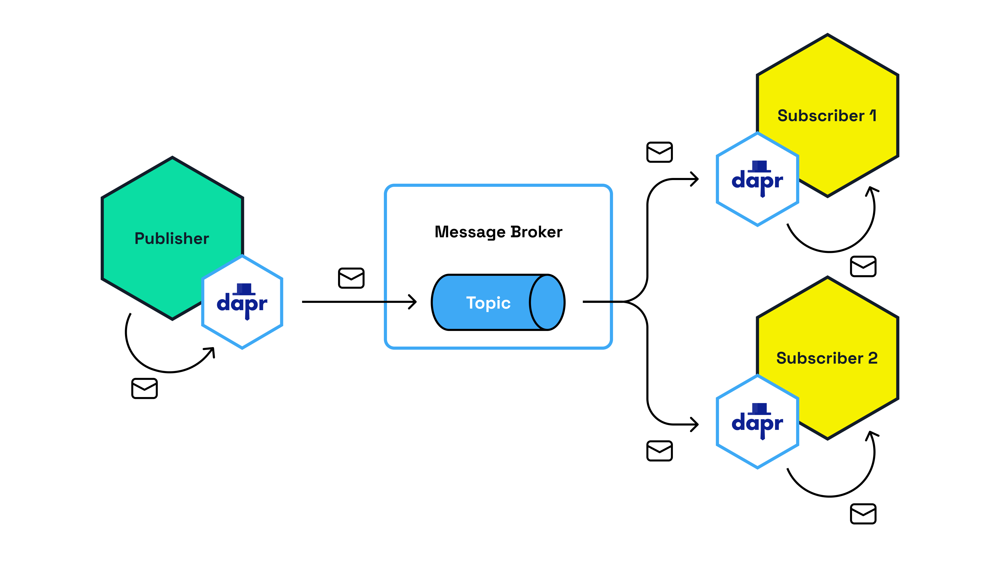

# Dapr Multi-App Run

This is a sample project to demonstrate how to run multiple Dapr apps with a single `dapr run` command.

This repository contains three Node.js applications:

- `/src/publisher` - publishes 10 messages to a topic named `orders`.
- `/src/subscriber1` - subscribes to the `orders` topic and logs the received messages.
- `/src/subscriber2` - subscribes to the `orders` topic and logs the received messages.



All three Dapr applications use a pubsub component named `orderpubsub` which uses a local Redis container as the message broker. See the [pubsub.yaml](./resources/pubsub.yaml) component file for the details.

## Prerequisites

1. Linux or macOS (Windows is not yet supported)
2. [Nodejs](https://nodejs.org/en/download)
3. [Docker Desktop](https://www.docker.com/products/docker-desktop/)
4. [Dapr CLI](https://docs.dapr.io/getting-started/install-dapr-cli/)

## Running the demo

1. Run `npm run install-all` in the root of this repository to install the Node modules for the three apps.

2. Run this command in the root of this repository to start the Dapr runtime and the three apps:

```bash
dapr run -f .
```

The command above will read the [dapr.yaml](./dapr.yaml) multi-app run template file that contains the multi-app run configuration.

The output should be similar to this:

```bash
⚠  This is a preview feature and subject to change in future releases.
ℹ️  Validating config and starting app "subscriber1"
== APP - subscriber1 == 
== APP - subscriber1 == > subscriber1@1.0.0 start
== APP - subscriber1 == > node index.js
== APP - subscriber1 == 
== APP - subscriber1 == 2023-08-20T13:46:06.145Z INFO [HTTPServer, HTTPServerImpl] [Topic = orders] Registered Subscription with routes: default
== APP - subscriber1 == 2023-08-20T13:46:06.146Z INFO [HTTPServer, HTTPServer] Listening on 5101
== APP - subscriber1 == 2023-08-20T13:46:06.146Z INFO [HTTPServer, HTTPServer] Registering 1 PubSub Subscriptions
== APP - subscriber1 == 2023-08-20T13:46:06.157Z INFO [HTTPClient, HTTPClient] Sidecar Started
== APP - subscriber1 == 2023-08-20T13:46:06.174Z INFO [HTTPServer, HTTPServer] Registered 1 PubSub Subscriptions
ℹ️  Started Dapr with app id "subscriber1". HTTP Port: 54179. gRPC Port: 54180
ℹ️  Writing log files to directory : /Users/marcduiker/dev/diagrid-labs/multi-app-run/src/subscriber1/.dapr/logs
ℹ️  Validating config and starting app "subscriber2"
== APP - subscriber2 == 
== APP - subscriber2 == > subscriber2@1.0.0 start
== APP - subscriber2 == > node index.js
== APP - subscriber2 == 
== APP - subscriber2 == 2023-08-20T13:46:07.165Z INFO [HTTPServer, HTTPServerImpl] [Topic = orders] Registered Subscription with routes: default
== APP - subscriber2 == 2023-08-20T13:46:07.167Z INFO [HTTPServer, HTTPServer] Listening on 5102
== APP - subscriber2 == 2023-08-20T13:46:07.168Z INFO [HTTPServer, HTTPServer] Registering 1 PubSub Subscriptions
== APP - subscriber2 == 2023-08-20T13:46:07.182Z INFO [HTTPClient, HTTPClient] Sidecar Started
== APP - subscriber2 == 2023-08-20T13:46:07.197Z INFO [HTTPServer, HTTPServer] Registered 1 PubSub Subscriptions
ℹ️  Started Dapr with app id "subscriber2". HTTP Port: 54211. gRPC Port: 54212
ℹ️  Writing log files to directory : /Users/marcduiker/dev/diagrid-labs/multi-app-run/src/subscriber2/.dapr/logs
ℹ️  Validating config and starting app "publisher"
ℹ️  Started Dapr with app id "publisher". HTTP Port: 54245. gRPC Port: 54246
ℹ️  Writing log files to directory : /Users/marcduiker/dev/diagrid-labs/multi-app-run/src/publisher/.dapr/logs
== APP - publisher == 
== APP - publisher == > publisher@1.0.0 start
== APP - publisher == > node index.js
== APP - publisher == 
== APP - publisher == 2023-08-20T13:46:09.263Z INFO [HTTPClient, HTTPClient] Sidecar Started
== APP - publisher == Published: {"orderId":1}
== APP - subscriber2 == Subscriber 2 received: {"orderId":1}
== APP - subscriber1 == Subscriber 1 received: {"orderId":1}
== APP - publisher == Published: {"orderId":2}
== APP - subscriber2 == Subscriber 2 received: {"orderId":2}
== APP - subscriber1 == Subscriber 1 received: {"orderId":2}
== APP - subscriber2 == Subscriber 2 received: {"orderId":3}
== APP - subscriber1 == Subscriber 1 received: {"orderId":3}
== APP - publisher == Published: {"orderId":3}
== APP - publisher == Published: {"orderId":4}
== APP - subscriber2 == Subscriber 2 received: {"orderId":4}
== APP - subscriber1 == Subscriber 1 received: {"orderId":4}
== APP - subscriber1 == Subscriber 1 received: {"orderId":5}
== APP - subscriber2 == Subscriber 2 received: {"orderId":5}
== APP - publisher == Published: {"orderId":5}
== APP - publisher == Published: {"orderId":6}
== APP - subscriber2 == Subscriber 2 received: {"orderId":6}
== APP - subscriber1 == Subscriber 1 received: {"orderId":6}
== APP - publisher == Published: {"orderId":7}
== APP - subscriber1 == Subscriber 1 received: {"orderId":7}
== APP - subscriber2 == Subscriber 2 received: {"orderId":7}
== APP - publisher == Published: {"orderId":8}
== APP - subscriber1 == Subscriber 1 received: {"orderId":8}
== APP - subscriber2 == Subscriber 2 received: {"orderId":8}
== APP - publisher == Published: {"orderId":9}
== APP - subscriber1 == Subscriber 1 received: {"orderId":9}
== APP - subscriber2 == Subscriber 2 received: {"orderId":9}
== APP - publisher == Published: {"orderId":10}
== APP - subscriber1 == Subscriber 1 received: {"orderId":10}
== APP - subscriber2 == Subscriber 2 received: {"orderId":10}
Exited App successfully
```

Note that the application logs are shown in the console as well as the `.dapr/logs` folder of each Node application. The Dapr logs are only present in the `.dapr/logs` folder.

## Resources

For more info on multi-app run, see the [Dapr documentation](https://docs.dapr.io/developing-applications/local-development/multi-app-dapr-run/).

## More information

Any questions or comments about this sample? Join the [Dapr discord](https://bit.ly/dapr-discord) and contact me (@marcduiker).
Have you made something with Dapr? Post a message in the `#show-and-tell` channel, we love to see your creations!
